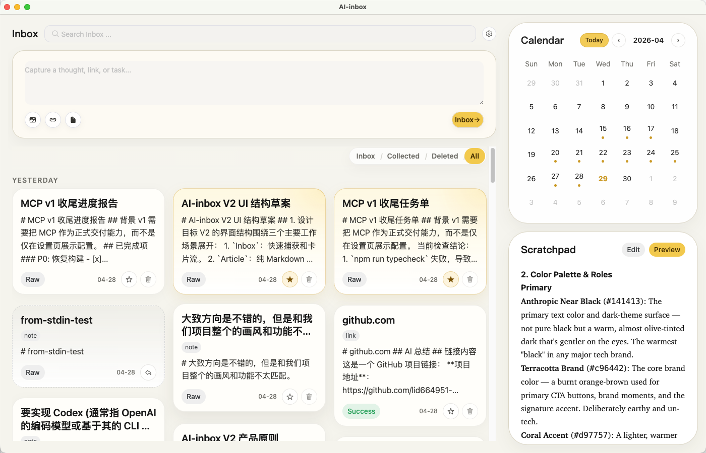
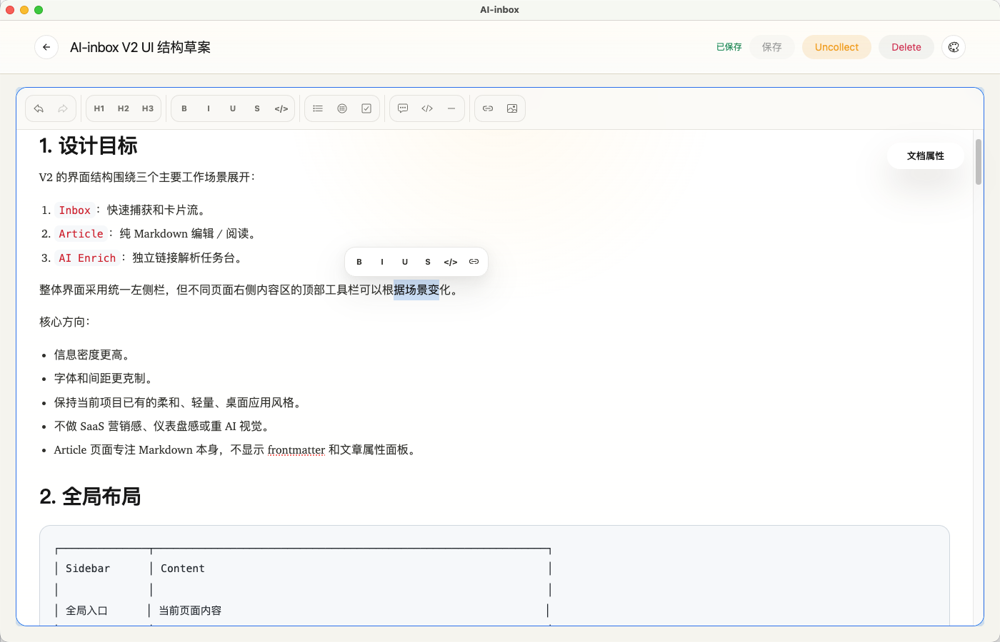
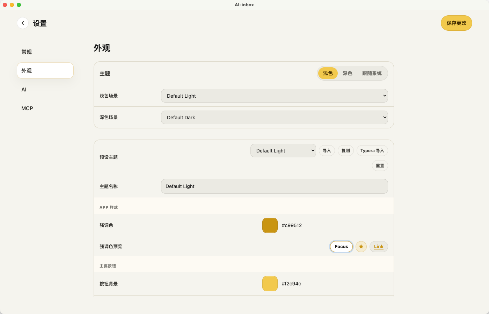

# AI-inbox

AI-inbox is a local-first desktop inbox for capturing notes, links, tasks, and research fragments, then turning them into a personal Markdown knowledge base.

It is built with Electron, Vue 3, TypeScript, Vite, and Pinia. The app is designed for private local workflows: quick capture first, structured review second, and AI assistance as an optional layer rather than the source of truth.

## Screenshots

### Home / Inbox

Capture notes, links, and tasks into a card-based inbox with calendar navigation and a scratchpad for temporary Markdown.



### Article Editor

Open captured items as Markdown documents, edit rich content, adjust document state, and work with a polished local editor.



### Settings

Configure local folders, MCP server behavior, AI provider settings, and the visual theme system.



## What It Does

- Quick capture for notes, todos, links, images, and research snippets.
- Local Markdown storage under a configurable inbox folder.
- Card-based review flow with Inbox, Collected, and Deleted buckets.
- Rich Markdown article editor with theme controls.
- Calendar and scratchpad side panel for lightweight daily organization.
- Built-in MCP server hooks for AI clients and automation workflows.
- AI provider settings for optional enrichment and connection testing.
- Theme customization, imported Typora-style themes, and visual editor controls.

## Why Local First

AI-inbox is meant to keep user content portable. Notes are stored as Markdown files, so they remain readable outside the app and can be backed up, edited, or indexed by other local tools.

The V1 app still includes document metadata and enrichment state in Markdown frontmatter. V2 work is moving toward a cleaner model where Markdown stays pure and app state lives in sidecar metadata.

## Tech Stack

- Electron
- Vue 3
- TypeScript
- Vite
- Pinia
- Naive UI
- TipTap rich editor
- MCP server integration

## Getting Started

Install dependencies:

```bash
npm install
```

Run the desktop app in development mode:

```bash
npm run dev
```

Run type checking:

```bash
npm run typecheck
```

Build the app:

```bash
npm run build
```

## Project Status

This branch represents the V1 baseline of AI-inbox: a functional local desktop inbox with Markdown editing, theme customization, and early AI/MCP integration.

V2 development is being explored separately with a stronger emphasis on pure Markdown files, sidecar metadata, multiple workspaces, and an independent AI Enrich task queue.
