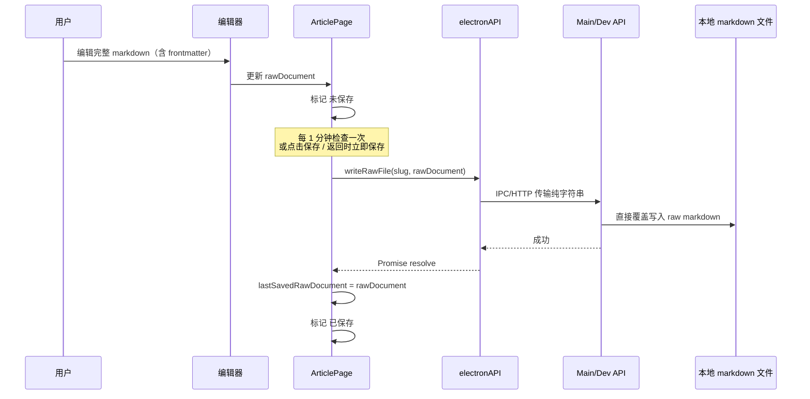

# ArticlePage 编辑与保存方案文档

本文档是基于当前讨论结果整理出的新方案文档，用于指导 `ArticlePage` 后续重构。

目标：

- 解决当前保存报错与保存链路复杂的问题
- 降低自动保存频率
- 明确保存状态反馈
- 统一“正文内容”和“文档属性”的编辑模型
- 把文档本身作为唯一真相源

---

## 1. 已确认的产品决策

### 1.1 编辑器显示完整 markdown 原文

`ArticlePage` 编辑器中直接显示并编辑完整 markdown 文件原文，包括：

- frontmatter
- 正文 body

用户看到的内容类似：

```md
---
title: "标题"
status: "ready"
bucket: "inbox"
enrichStatus: "none"
tags: ["demo"]
---

这里是正文内容
```

这意味着：

- frontmatter 不再只是内部结构
- frontmatter 也属于用户可编辑内容
- 文档属性本身就是文档内容的一部分

### 1.2 保存真相源

最终决定：

> 以磁盘上的整篇 markdown 原文作为唯一真相源。

具体解释：

- renderer 不再把 `frontmatter` 和 `body` 当成两个独立保存对象
- 保存接口只处理“整篇原文字符串”
- main process 负责最终写盘
- UI 展示属性时，如果需要 `title/status/bucket/enrichStatus/tags`，就从当前原文临时解析

### 1.3 外部文件变化策略

当前页无未保存内容时：

- 自动刷新当前编辑器内容

当前页有未保存内容时：

- 不自动覆盖
- 显示冲突提示

冲突提示至少提供两个动作：

- `重新加载磁盘版本`
- `保留当前编辑内容`

### 1.4 状态字段命名保持不变

继续沿用当前字段命名：

- `bucket`
- `status`
- `enrichStatus`

不另起新的状态字段体系。

### 1.5 保存频率与触发方式

保存行为调整为：

- 输入时不再 500ms 自动保存
- 改为 1 分钟自动保存一次
- 顶部导航栏新增 `保存` 按钮
- 点击返回时自动保存

### 1.6 frontmatter 非法时的处理方式

当用户把 frontmatter 改坏，导致解析失败时：

- 允许保存原文
- 不阻止写盘
- 但顶部提示：
  - `frontmatter 解析失败，部分属性 UI 不可用`

这意味着：

- 编辑自由度优先
- UI 尽量容错
- 属性按钮与状态展示基于“能解析则显示，不能解析则降级”

### 1.7 文档属性区默认折叠

虽然编辑器内部仍然处理完整 markdown 原文，但展示层需要把最上方 frontmatter 区域识别为一个可折叠区块。

区块标题固定为：

- `文档属性`

展示规则：

- 页面正常打开时默认折叠
- 用户可以主动展开并直接编辑原始 YAML 文本
- 如果 frontmatter 解析失败，则自动展开

这里的“折叠”只存在于编辑器 UI 层，不改变文档存储格式：

- 不新增特殊 markdown 语法
- 不向磁盘写入折叠标记
- frontmatter 仍然是原文的一部分

### 1.8 frontmatter 修复能力暂不纳入第一阶段

后续会补充两项能力，但本轮先不实现：

- frontmatter 修复模板
- frontmatter 自动/半自动修复功能

当前阶段先保证：

- frontmatter 可以直接查看和编辑
- frontmatter 解析失败时仍允许保存
- UI 可以明确提示异常

---

## 2. 新的数据模型

## 2.1 页面内核心状态

重构后的 `ArticlePage` 建议只保留以下核心状态：

- `rawDocument`
  - 当前编辑器中的完整 markdown 原文
- `lastSavedRawDocument`
  - 最近一次成功保存到磁盘的完整 markdown 原文
- `saveState`
  - 保存状态
- `isDirty`
  - 当前是否存在未保存修改
- `hasExternalChange`
  - 当前文件是否被外部改动过
- `frontmatterParseError`
  - frontmatter 是否解析失败

其中：

- `rawDocument` 是编辑中的草稿
- `lastSavedRawDocument` 是页面当前认知下的最近落盘版本
- 两者比较即可得出 `isDirty`

## 2.2 保存状态枚举

建议保存状态统一为：

- `unsaved`
- `saving`
- `saved`
- `error`

界面文案分别显示为：

- `未保存`
- `保存中`
- `已保存`
- `保存失败`

---

## 3. 新的保存真相模型

## 3.1 为什么不再拆 frontmatter 和 body

当前实现里，保存链路把文档拆成：

- `frontmatter`
- `body`

然后在 renderer、preload、main process 之间来回传递对象，再重新拼成 markdown 文件。

这个模型的问题是：

- 保存链路变长
- 同步点变多
- frontmatter/body 容易出现状态不一致
- IPC 传输对象更复杂
- 结合 TipTap 编辑器后，更容易出现意料之外的数据结构问题

所以这次改造的核心原则是：

> 存储与保存层不再拆 frontmatter/body，只把文档视为一整个字符串。

## 3.2 新的读写原则

### 读取

读取接口返回：

- 完整 markdown 原文 `raw`

页面如需显示属性，再自行解析：

- `title`
- `status`
- `bucket`
- `enrichStatus`
- `tags`

### 保存

保存接口只接收：

- `slug`
- `raw markdown string`

main process 收到后直接覆盖写回原文件。

即：

```ts
writeRawFile(slug, raw)
```

而不是：

```ts
updateFile(slug, { frontmatter, body })
```

---

## 4. 新的页面编辑流

## 4.1 打开页面

进入 `ArticlePage` 时：

1. 根据 `slug` 读取本地 markdown 原文
2. 将完整原文写入编辑器
3. 设置：
   - `rawDocument = 文件原文`
   - `lastSavedRawDocument = 文件原文`
   - `isDirty = false`
   - `saveState = 'saved'`
4. 尝试解析 frontmatter
5. 若解析成功，则在顶部展示属性信息
6. frontmatter 在编辑器中以默认折叠的 `文档属性` 区块展示
7. 若解析失败，则顶部提示 frontmatter 异常，并自动展开 `文档属性`

## 4.2 用户输入

用户输入时：

1. 编辑器内容变化
2. 更新 `rawDocument`
3. 若 `rawDocument !== lastSavedRawDocument`
   - `isDirty = true`
   - `saveState = 'unsaved'`
4. 不立即写盘

其中 `文档属性` 区块中的 YAML 编辑与正文编辑共享同一套机制：

- 都属于同一个 `rawDocument`
- 都共享同一个 dirty 状态
- 都共享同一条保存链路

## 4.3 自动保存

页面启动一个固定周期定时器：

- 每 1 分钟执行一次检查

逻辑为：

1. 如果 `isDirty === false`
   - 不保存
2. 如果当前正在保存
   - 跳过本轮
3. 否则执行保存

## 4.4 手动保存

手动保存入口包括：

- 点击顶部 `保存` 按钮
- `Cmd/Ctrl + S`

逻辑与自动保存一致，但立即触发。

## 4.5 返回页面

点击返回时：

1. 如果 `isDirty === false`
   - 直接返回
2. 如果 `isDirty === true`
   - 先执行一次保存
   - 保存成功后返回
   - 保存失败则留在当前页，并提示错误

---

## 5. 新的保存链路设计

## 5.1 保存接口建议

建议提供单一保存接口：

```ts
readRawFile(slug): Promise<string | null>
writeRawFile(slug, raw: string): Promise<void>
```

无论 Electron 正式环境还是浏览器开发环境，都统一这两个接口语义。

## 5.2 Electron 正式通道

建议链路：

1. `ArticlePage`
2. `window.electronAPI.writeRawFile(slug, raw)`
3. `preload.ts`
4. `ipcRenderer.invoke('inbox:write-raw', slug, raw)`
5. `electron/main.ts`
6. `ipcMain.handle('inbox:write-raw', ...)`
7. `fs.writeFileSync(filepath, raw, 'utf-8')`

关键点：

- IPC 只传纯字符串
- 不传复杂对象
- 不在主进程做 frontmatter/body 合并

## 5.3 浏览器开发通道

建议链路：

1. `ArticlePage`
2. `window.electronAPI.writeRawFile(slug, raw)`
3. `browser-electron-api.ts`
4. `POST /__dev_api/inbox/:slug/raw`
5. dev middleware
6. `fs.writeFileSync(filepath, raw, 'utf-8')`

同样只传纯字符串。

---

## 6. 导航栏与保存状态设计

## 6.1 导航栏新增元素

顶部导航栏建议包括：

- 返回按钮
- 保存状态文案
- 保存按钮
- 文档属性信息区
- enrich / collect / delete / restore 操作区

编辑器正文上方另有一个可折叠区块：

- `文档属性`

用于承载 frontmatter 原始文本编辑。

## 6.2 保存状态展示

建议文案：

- `未保存`
- `保存中`
- `已保存`
- `保存失败`

如果 frontmatter 解析失败，在导航栏补充提示：

- `frontmatter 解析失败，部分属性 UI 不可用`

## 6.3 保存按钮行为

点击 `保存` 按钮时：

1. 若当前无变更
   - 不写盘
   - 维持 `已保存`
2. 若当前有变更
   - 执行保存

---

## 7. 文档属性模型

## 7.0 展示形态

frontmatter 在编辑器中不应始终裸露在正文顶部，而应以一个默认折叠的 `文档属性` 区块出现。

展示规则：

- 默认折叠
- 用户可手动展开
- frontmatter 解析失败时自动展开

该区块本质上只是展示层折叠，不改变文档结构：

- 不新增特殊 markdown 语法
- 不向磁盘写入额外标记
- 不改变原始文件格式

也就是说，折叠仅存在于编辑器 UI 层。

## 7.1 enrich / collect / delete / restore 的本质

这些操作不再被视为“软件内部状态切换”，而是：

> 修改文档 frontmatter 的操作。

因此，它们应该统一归属于文档本身。

也就是说：

- 软件不额外维护一套独立文章状态
- 文档当前状态以文档 frontmatter 为准

## 7.2 属性按钮的实现原则

例如 `Collect`、`Delete`、`Restore`、`Enrich`：

1. 读取当前编辑器中的完整 `rawDocument`
2. 临时解析 frontmatter
3. 修改字段：
   - `bucket`
   - `status`
   - `enrichStatus`
   - `updated`
4. 重新生成完整原文
5. 回写到编辑器内容
6. 标记为 `未保存`
7. 再由统一保存链路落盘

也就是说：

- 这些按钮不是调用单独“状态 API”
- 而是“改文档内容”

## 7.3 frontmatter 解析失败时的降级行为

如果当前原文中的 frontmatter 解析失败：

- 仍允许编辑
- 仍允许保存
- 顶部属性区可降级隐藏或只显示部分原始信息
- enrich / collect / delete / restore 等依赖 frontmatter 解析的按钮可以：
  - 暂时禁用
  - 或提示用户先修复 frontmatter

建议第一版采取保守策略：

- frontmatter 解析失败时，属性按钮禁用
- 但普通文本编辑和保存仍可继续

---

## 8. 外部文件变化与自动刷新

## 8.1 基本原则

项目已有文件监听能力，所以新方案继续利用 watcher。

当当前文章对应文件发生外部变化时：

### 情况 A：当前页没有未保存修改

行为：

- 自动读取磁盘最新版
- 刷新编辑器内容
- 更新：
  - `rawDocument`
  - `lastSavedRawDocument`
  - `saveState = 'saved'`

### 情况 B：当前页有未保存修改

行为：

- 不自动覆盖
- 标记 `hasExternalChange = true`
- 弹出冲突提示

建议提示文案：

- `该文件已在外部发生变化。`

操作选项：

- `重新加载磁盘版本`
- `保留当前编辑内容`

## 8.2 为什么不强制自动覆盖

因为用户既然已经在当前页产生了未保存修改，那么静默自动刷新会导致：

- 当前输入被冲掉
- 用户难以理解数据丢失原因

所以当前方案采用“安全自动刷新”：

- 干净页面自动刷新
- 脏页面冲突提示

---

## 9. 对当前 bug 的判断与规避方向

## 9.1 当前报错现象

已知现象：

- 保存会报错：`an object could not be clone`

## 9.2 高概率成因判断

该报错更像是：

- Electron IPC 在传输某个不可 clone 的对象

而不是：

- markdown 文件内容本身有问题

从当前架构看，高风险点包括：

- 保存时传输复杂对象
- 某些监听回调直接传 Electron event 对象
- 编辑器相关对象被意外带入保存链路

## 9.3 本方案如何规避

本方案通过以下方式降低该错误风险：

1. 保存 IPC 只传纯字符串
2. 不再传 `{ frontmatter, body }` 这类复合对象作为主要保存载荷
3. renderer 与 main 的接口语义改为：
   - `read raw`
   - `write raw`
4. 属性操作也只在 renderer 内先改字符串，再走统一字符串保存接口

也就是说：

> 先把保存链路“字符串化、单一化”，是这次修复的重要方向。

---

## 10. 重构后的总时序



---

## 11. 第一阶段建议落地范围

建议第一阶段只做这些核心改动：

1. 编辑器改为编辑完整 markdown 原文
2. 保存接口改为 `read raw / write raw`
3. 去掉 500ms 自动保存，改为 1 分钟自动保存
4. 导航栏增加保存状态与保存按钮
5. 将 frontmatter 作为默认折叠的 `文档属性` 区块展示
6. 返回前自动保存
7. 接入外部文件变化检测
8. 干净状态自动刷新，脏状态弹冲突提示

建议暂时不要在第一阶段加入：

- 自动 merge 冲突
- 文档副本保存
- 复杂版本控制
- frontmatter 修复模板
- frontmatter 自动/半自动修复

先把保存链路收敛为稳定模型，再做增强。

---

## 12. 最终结论

这次 `ArticlePage` 的重构方向可以总结为一句话：

> 把文章当作“完整 markdown 文档”来编辑和保存，而不是“frontmatter + body”两个分离对象；文档原文是唯一真相源，软件界面只是在这个真相源上做解析、展示和属性修改。

这个方向最符合当前产品诉求：

- frontmatter 可以直接编辑
- 属性属于文档自身
- 保存链路更短
- IPC 更简单
- 自动刷新和冲突处理更可控
- 后续更容易修复当前保存 bug
